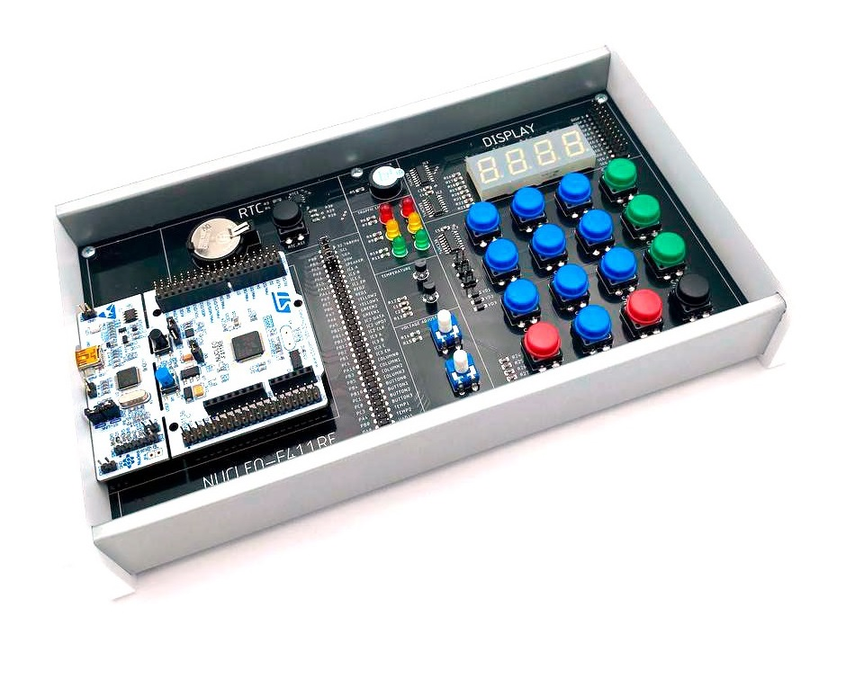

# Импульс. Аппаратно-программный комплекс для изучения МК семейства STM32. SWD01



## Быстрый запуск

### Файл конфигурации CubeMX
* Открыть файл [`smc.ioc`](/smc.ioc) в CubeMX (вер. 6.14.1).
* Перейти на вкладку Project Manager.
* Toolchain / IDE выбрать STM32CubeIDE.
* Firmware Packadge Name and Version выбрать STM32Cube FW_F4 V1.28.0.
* Выполнить команду GENERATE CODE
* После успешной генерации проекта, выполнить Open Project

### Настройка CubeIDE

* Выполнить пункт меню Project/Properties/"C/C++ General"
* Раскрыть выпадающий список и выполнить Path and Symbols
* Вкладка Source Location выполнить Add Folder и добавить папку Apart
* Вкладка Includes выполнить Add и добавить Apart/Modules, Apart/Tasks
* Выполнить компиляцию и программирование

### Основная программа

* В файле 'main.c' добавить следующие строки:

```c
/* USER CODE BEGIN Includes */

#include "tasks.h"

/* USER CODE END Includes */
```

```c
  /* USER CODE BEGIN 2 */

  TASK_START(tasks.power->state);

  /* USER CODE END 2 */
```

```c
  tasks_loop();

/* USER CODE END WHILE */
```
    